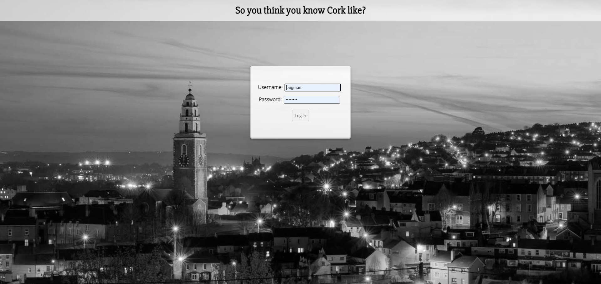
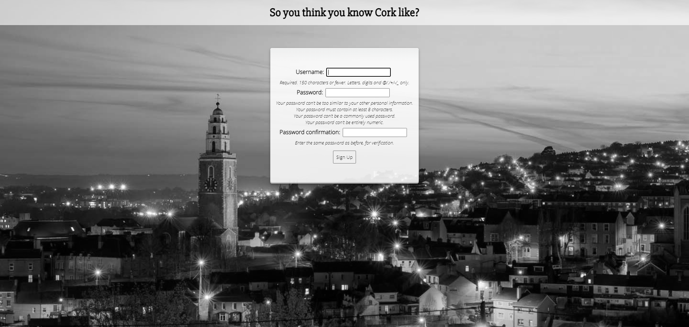
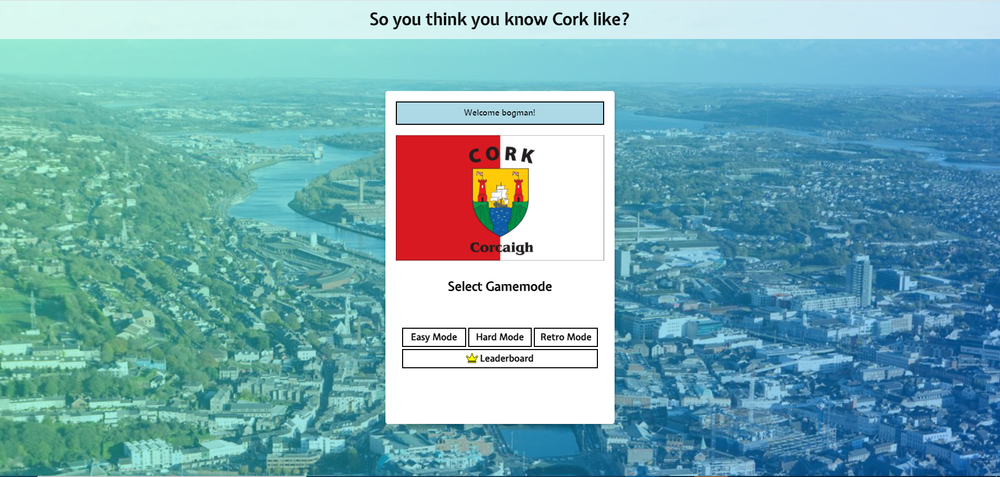
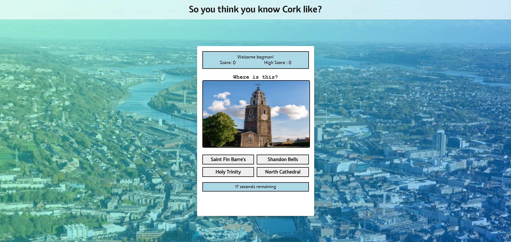
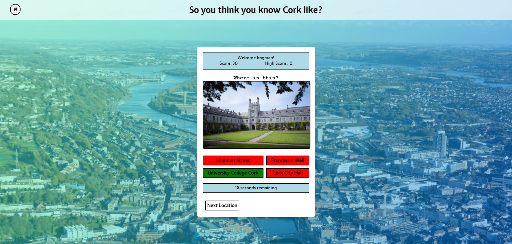
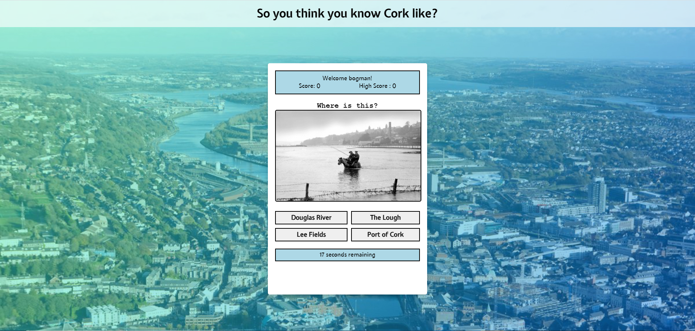
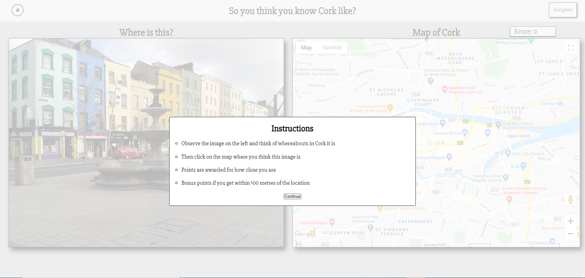
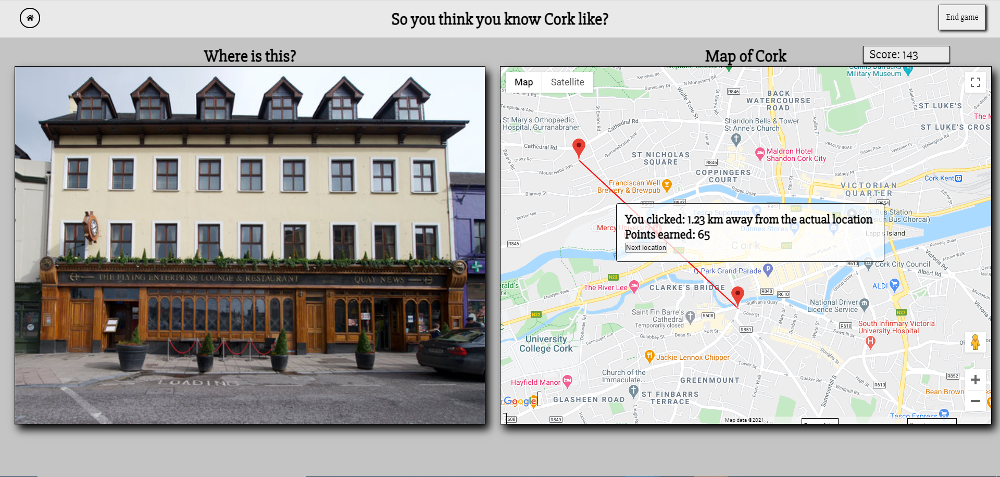
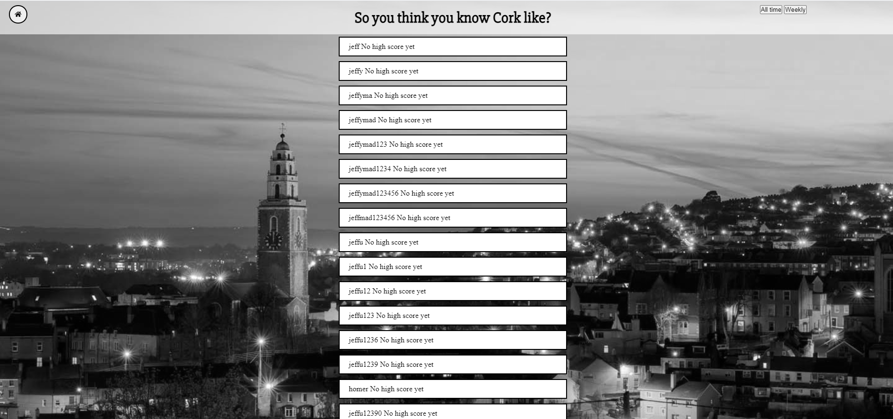

# TeamProject2021

## Name: So you think know Cork?
## Group: 6 
## Module: CS3305

## Team members:
* [John Wales](https://github.com/JohnWales)
* [Nathan Crowley](https://github.com/NathanCrowley)
* [Eoin Treacy](https://github.com/treacy998)
* [Mark Cullinane](https://github.com/mcullinane28)
* [Jeff Attride](https://github.com/Jeffride)

## Contribution

## Scrum Standup Timetable
1. [Jeff Attride](https://github.com/Jeffride) (3rd February)
2. [John Wales](https://github.com/JohnWales) (8th February)
3. [Nathan Crowley](https://github.com/NathanCrowley) (15th February)
4. [Mark Cullinane](https://github.com/mcullinane28) (22nd February)
5. [Eoin Treacy](https://github.com/treacy998) (1st March)

### Prerequisites for running locally
- latest version of Django framework
- Python3

### Start-up Guide:
1. Clone this repo to your local machine
2. Navigate to the downloaded folder.
3. CD into the git directory containing the project and navigate to the folder containing manage.py
4. Next type the commmand "python manage.py runserver", this will start a developement server at http://127.0.0.1:8000/ in your browser.
5. Open your browser and open http://127.0.0.1:8000/.

### Compatibility

* This project has been tested on Mac, Linux and Windows

### Booch Diagram

## Latest Updates 04/03/2021
* Admin page added for private image uploading
* Retro mode implemented
* leaderboard linked to maps mode
* improved css styling accross the app
* bug fixes

## Latest Updates 22/02/2021
* Random place generated on page load
* google maps implemented under the hard mode
* improved css styling
* bug fixes

## Latest Updates 7/02/2021
* login/registration page styled and tested with many test cases such as invalid passwords/usernames etc.
* leaderboard implemented.
* common css styling across pages using a grid layout.
* images fetched and stored in effiecient manor.
* each page linked up to each other.
### Latest Screenshots 
## 04/03/2021
#### Login page

#### Registration page

#### Home page

#### Easy mode

#### Retro mode

#### Hard mode

#### Leaderboard

## 07/02/2021
#### Login page

#### Registration page

#### Game menu

#### Game

